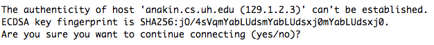
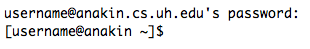
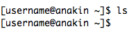
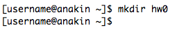
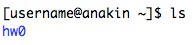
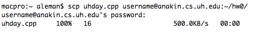
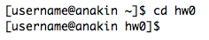
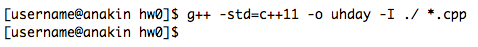
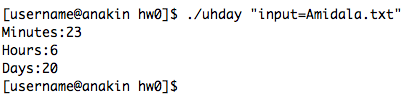

# Copy files to the linux server

Example of copying files from a local computer to the linux server. The steps assume that you are already in a local shell, such as on the Terminal on a Mac computer, or SSH Shell in Windows, or Cygwin on Windows, or the command-line in a local linux (such as Ubuntu).

**username**: The examples utilize `username` instead of a real username to avoid exposing the name of a real account.

**anakin.cs.uh.edu**: is a fake hostname utilized in the examples instead of the real hostname (to avoid exposing the name of the real hostname).

## Steps

1. The start point is the command-line, such as:

   

2. Use the ssh command to login to the linux server:

   

   (You will have to replace `username` with your username, and specify the correct hostname instead of the fake example shown above).

   If it is the first time you login to that server, it may ask you about saving the key fingerprint, such as:

   

   Just type `yes` and hit enter to continue.

3. Then, it is going to ask you for your password, and the command-line prompt will look different because you will be logged in to the linux server:

   

4. In the event that you have not changed your password, then set a secure password. The steps will look like this:

   

5. The first time around, there will be zero files, zero folders, doing `ls` would show nothing:

   

6. Create a folder for `hw0` using `mkdir`, such as:

   

7. Now, you can see the newly created folder if you do `ls`

   

8. At this point, you could copy your .cpp file into that folder via a variety of methods, one of which is `scp`. Here is an example, assuming that you are in another window (or tab) at your **local** SSH shell program.

   

9. Go back to the shell window of the linux server. Go inside the `hw0` folder:

   

10. Then, compile your code according to the directions of the programming assignment. This is an example only (the programming assignment instructions are the ones to follow because they may change in different assignments).

   Here is an example where the code fails to compile because `main` is defined in more than one file.

   

   The problem was solved by deleting file `Test.cpp` via this command: `rm -i Test.cpp`

   (The `-i` flag to the remove command will prompt for confirmation for the deletion of a file; I always use it due to learning my lesson the hard way).

   Attempt to compile the code again, and when there are no errors, there is no complaining.

   

10. Run the code with a text-file as input:

   
